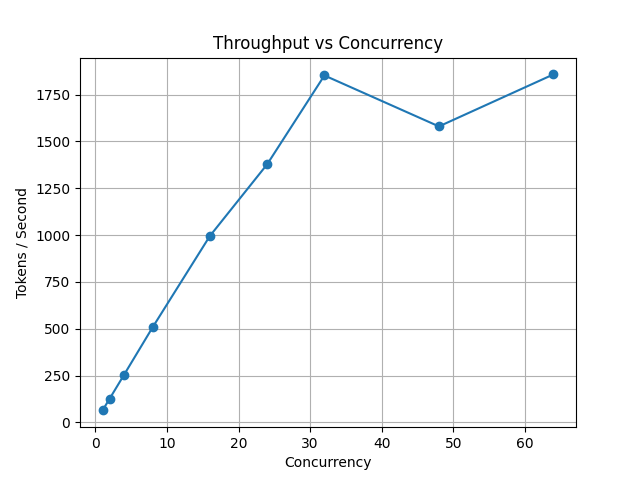
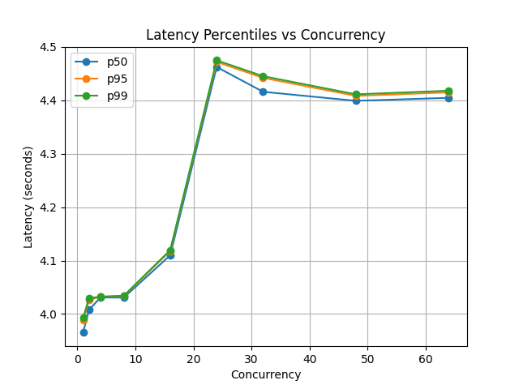
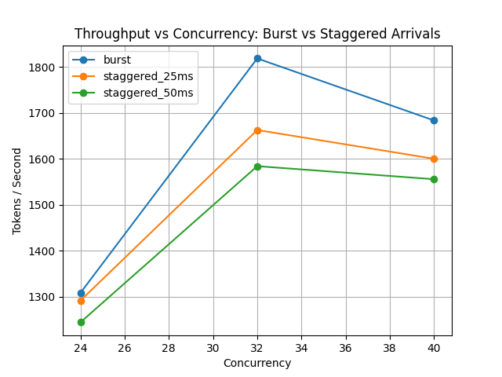

# LLM Inference Benchmark Harness

A lightweight Python harness for benchmarking LLM inference servers under increasing concurrency.

The goal is to measure **throughput scaling and latency behavior (p50 / p95 / p99)** as load increases and identify the **saturation point of an inference system**.

The harness targets **OpenAI-compatible endpoints**, including:

- vLLM  
- Triton Inference Server  
- TensorRT-LLM  
- OpenAI API-compatible gateways

This project focuses on understanding **how GPU inference systems behave under load**, including:

- batching efficiency
- scheduler behavior
- concurrency scaling
- throughput saturation

---

# What This Harness Measures

For each concurrency level the benchmark records:

- number of requests
- elapsed wall time
- requests/sec
- tokens/sec
- latency p50
- latency p95
- latency p99
- mean latency

The harness sweeps across increasing concurrency levels and produces plots showing:

1. **Throughput scaling**
2. **Tail latency growth**

These curves make it easy to identify when the system transitions from efficient utilization to **queueing and saturation**.

---

# Running the Benchmark

## Step 1 — Start an inference server

Example using **vLLM**:

```bash
python -m vllm.entrypoints.openai.api_server \
  --model Qwen/Qwen2.5-7B-Instruct \
  --host 0.0.0.0 \
  --port 8000
```

This exposes an OpenAI-compatible endpoint:

```
http://localhost:8000/v1/completions
```

---

## Step 2 — Run the concurrency sweep

```bash
python bench.py \
  --model Qwen/Qwen2.5-7B-Instruct \
  --concurrency 1,2,4,8,16,24,32,48,64 \
  --max-tokens 256 \
  --requests-per-worker 5 \
  --out results/max_tokens_256.csv
```

This generates:

```
results/max_tokens_256.csv
```

---

## Step 3 — Generate plots

```bash
python plot_results.py
```

This produces:

```
results/throughput_*.png
results/latency_*.png
```

---

# System Configuration

All experiments were run with the following setup:

| Component | Configuration |
|----------|--------------|
| GPU | NVIDIA RTX 4090 (24GB VRAM) |
| Runtime | vLLM |
| Model | Qwen/Qwen2.5-7B-Instruct |
| API | OpenAI-compatible `/v1/completions` |
| Prompt workload | prompts.json (explanatory prompts) |
| Generation lengths tested | 64, 256, 512 tokens |
| Benchmark driver | custom Python asyncio harness |
| Request scheduling | burst + staggered arrival experiments |

The benchmark focuses on **decoder-heavy inference workloads**, which are typically **memory bandwidth bound during autoregressive generation**.

## Expirement 1 - Concurrency scaling

Experiments were run with three generation workloads:

| max_tokens | Workload Type |
|------------|--------------|
| 64 | short responses |
| 256 | typical assistant responses |
| 512 | long generations |

---

## Throughput (max_tokens = 256)



---

## Latency Percentiles (max_tokens = 256)



---

# Key Observation

Across all workloads the system saturated at approximately:

```
~1800 tokens/sec
```

on an **RTX 4090**.

What I found / observed:

- token throughput remained nearly constant across workloads
- request throughput decreased as generation length increased
- latency scaled roughly linearly with `max_tokens`
- saturation occurred around **~32 concurrent requests**

This confirms that **GPU decoding throughput becomes the primary bottleneck once the model is fully utilized.**

---

## Experiment 2 — Dynamic Batching Behavior

To better understand how inference schedulers handle request arrival patterns, we evaluated system performance under **burst** and **staggered** request arrivals near the saturation boundary.

Experiments were conducted at:

- concurrency: 24, 32, 40  
- max_tokens: 256  

---

### Arrival Patterns Tested

| Pattern | Description |
|--------|-------------|
| burst | all requests start simultaneously |
| staggered_25ms | each worker delayed by 25ms |
| staggered_50ms | each worker delayed by 50ms |

---

### Throughput vs Arrival Pattern



---

### Results

| Concurrency | Burst | Staggered 25ms | Staggered 50ms |
|-------------|------|---------------|---------------|
| 24 | ~1308 tokens/s | ~1291 tokens/s | ~1244 tokens/s |
| 32 | **~1819 tokens/s** | ~1663 tokens/s | ~1584 tokens/s |
| 40 | ~1684 tokens/s | ~1600 tokens/s | ~1556 tokens/s |

---

### Key Observations

- Peak throughput is achieved under **burst arrivals**
- Staggering requests results in a **small but consistent reduction in throughput**
- The effect is most pronounced near the **saturation point (32 concurrency)**

---


### Interpretation

These results indicate that **vLLM’s continuous batching scheduler is already optimized for bursty traffic**.

Even when requests arrive simultaneously, the scheduler efficiently:

- queues incoming requests  
- dynamically forms large batches  
- maximizes GPU utilization during decoding  

Artificially smoothing request arrivals does not improve performance and can slightly reduce batching efficiency.

This reflects how modern inference engines operate:

> They rely on internal request queues and token-level schedulers to construct optimal batches during autoregressive decoding, rather than depending on externally controlled traffic shaping.

---

## Experiment 3 — Output Length Sensitivity Near Saturation

To understand how workload shape impacts system performance, we evaluated latency and throughput near the saturation boundary while varying generation length.

Experiments were conducted at:

- concurrency: 24, 32, 40  
- max_tokens: 64, 128, 256, 512  

---

### Results (32 Concurrency)

| max_tokens | tokens/sec | p95 latency |
|------------|-----------|------------|
| 64 | ~1740 | ~1.17s |
| 128 | ~1763 | ~2.32s |
| 256 | ~1768 | ~4.63s |
| 512 | ~similar throughput | ~higher latency |

---

### Key Observations

- Throughput remains **relatively stable near saturation** across different output lengths  
- Latency increases **approximately linearly with max_tokens**  
- Increasing concurrency beyond saturation does not improve throughput  

---

### Interpretation

At the saturation boundary, the system maintains high throughput due to efficient batching and GPU utilization.

However, **tail latency increases significantly for longer generations**, indicating that response time is dominated by decode duration rather than scheduling inefficiencies.

This reveals a key production insight:

> Throughput alone is not sufficient to evaluate inference performance. Workload characteristics — especially output length — directly impact latency and user experience.

---

### Practical Implication

Inference systems should be sized based on:

- expected output length distributions  
- latency SLOs (p95 / p99)  
- not just peak tokens/sec capacity  

This is particularly important for applications such as:

- chat assistants (short responses)  
- agent workflows (medium responses)  
- code generation or summarization (long responses)  

### Motivation

LLM inference performance is often evaluated using **single-request latency**, which does not reflect real production conditions.

This experiment focuses on **concurrency-driven load behavior**, providing a more realistic view of:

- GPU utilization under load  
- batching efficiency  
- scheduler effectiveness  
- system behavior near saturation  

By simulating bursty and staggered traffic patterns, we better approximate real-world request distributions and uncover how inference systems behave under sustained load.

---

# Future Work

Next steps for this project:

- compare **vLLM vs TensorRT-LLM**
- analyze **GPU utilization during saturation**
- evaluate **multi-GPU inference scaling**
- test **longer generation workloads (1k+ tokens)**

---

# License

MIT License  
Marco Punio — 2026
