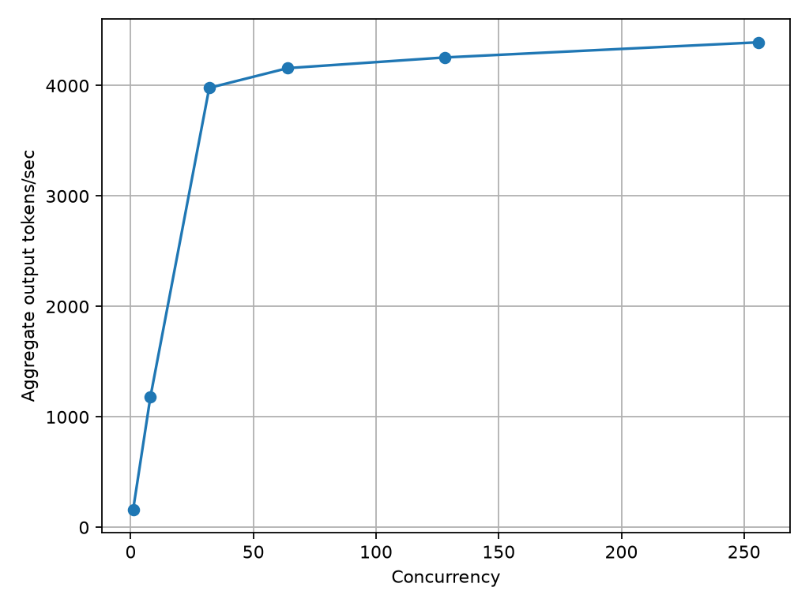
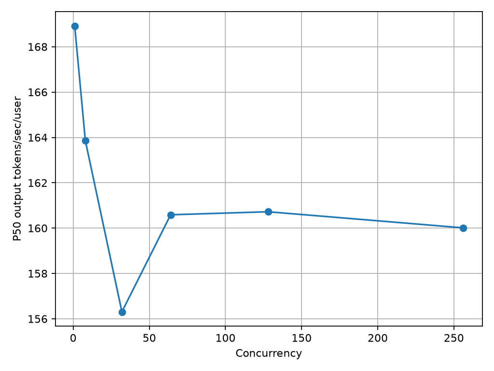
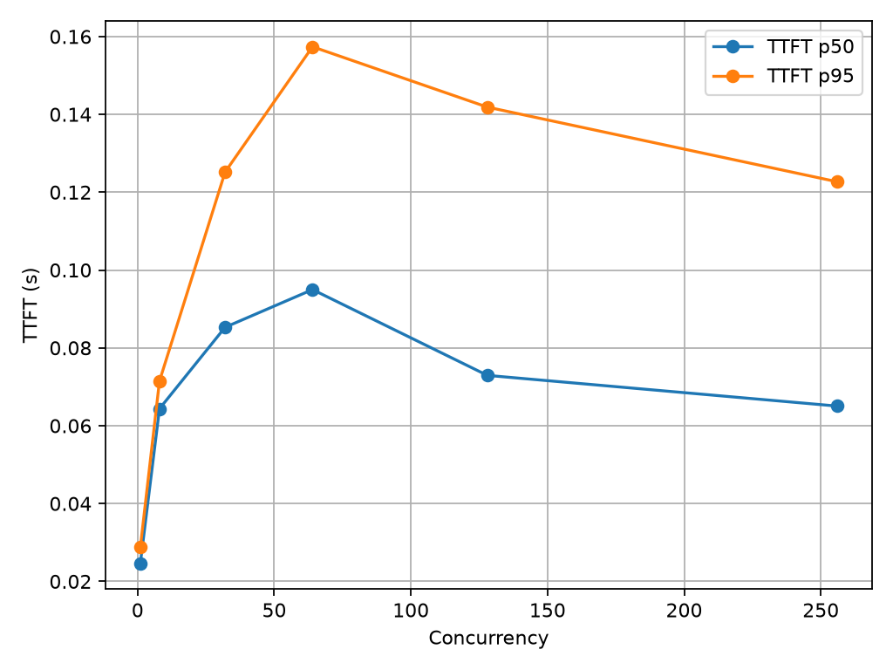
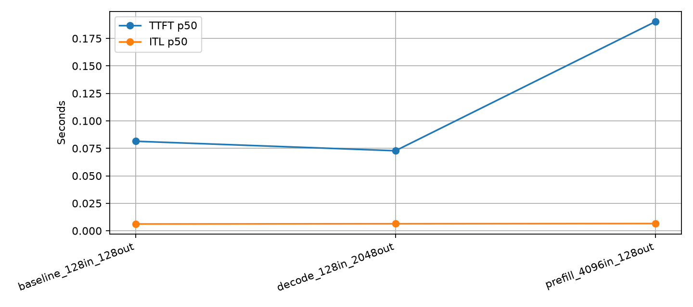

# LLM Inference Benchmark Harness

Python benchmark harness for measuring OpenAI-compatible LLM inference endpoints under concurrent load. The current headline result is a streaming benchmark of `Qwen/Qwen2.5-7B-Instruct` on a dedicated RunPod H100, focused on throughput, time-to-first-token, inter-token latency, and per-user generation speed.

The project is designed to separate system-level throughput from interactive user experience, because peak tokens/sec by itself is not enough to reason about production inference behavior.

## Why I Built This

LLM serving systems often look healthy when measured by aggregate throughput alone. In practice, users experience a mix of waiting for the first token, then reading streamed output at a per-request cadence. This harness measures those pieces separately so concurrency, workload shape, batching, and tail latency can be discussed with more precision.

The harness targets OpenAI-compatible endpoints, including vLLM, hosted API gateways, and other servers exposing `/v1/completions` or `/v1/chat/completions`.

## What This Harness Measures

- Aggregate output tokens/sec: total generated tokens completed per second across the benchmark.
- Output tokens/sec/user: generation rate experienced by an individual active request after the first token.
- TTFT: time from request submission to the first non-empty streamed token.
- ITL: request-level average inter-token latency after the first streamed token.
- Request latency: end-to-end completion time.
- Tail latency: p50/p95/p99 behavior under increasing concurrency.

Aggregate throughput is not the same as user interactivity. TTFT primarily exposes behavior before the first generated token, including request admission, scheduling, tokenization, and prefill. ITL and tokens/sec/user characterize generation after the first token. Workload shape materially affects which latency component dominates.

## H100 Streaming Benchmark

### Experimental Setup

| Field | Value |
|-------|-------|
| Hardware | RunPod dedicated GPU pod |
| GPU model | NVIDIA H100 80GB HBM3 |
| GPU count | 1 |
| Model | `Qwen/Qwen2.5-7B-Instruct` |
| Serving runtime | vLLM `0.30.0` |
| PyTorch | `2.13.0+cu130` |
| CUDA | CUDA `13.0` visible to PyTorch and NVIDIA-SMI |
| Precision | `bfloat16` |
| Tensor parallel size | 1 |
| Max model length | 32768 |
| API | OpenAI-compatible `/v1/completions` |
| Launch command | `vllm serve Qwen/Qwen2.5-7B-Instruct --host 0.0.0.0 --port 8000 --dtype bfloat16` |
| Notable vLLM startup behavior | chunked prefill enabled, prefix caching enabled, FlashAttention 3 selected, CUDA graphs captured |

Warmup requests were run before measurement and were excluded from result files.

### Key Findings

In the concurrency sweep with approximately 128 input tokens and 128 requested output tokens:

- Aggregate throughput increased from about 163 output tok/s at concurrency 1 to about 3,979 output tok/s at concurrency 32.
- Throughput then began flattening, reaching about 4,392 output tok/s at concurrency 256.
- Per-user generation speed remained approximately 156-161 output tok/s/user at higher concurrency.
- P50 ITL remained approximately 6.2-6.4 ms across most concurrency levels.

In the workload-shape sweep at concurrency 16:

- Increasing input length from about 128 to about 4096 tokens increased P50 TTFT from about 81 ms to about 190 ms, while ITL changed much less.
- Increasing requested output length to 2048 tokens resulted in about 13.15 seconds end-to-end P50 latency, while TTFT remained about 73 ms and ITL about 6.39 ms.

These measurements show that different workload shapes stress different latency components. They do not, by themselves, prove a specific hardware bottleneck.

## Key Visualizations









Full report: [results/streaming/report.md](results/streaming/report.md)

## Interpretation Boundaries

The results are consistent with common transformer inference behavior: longer prompts add work before the first token, and longer generations make decode duration dominate end-to-end latency. However, the benchmark does not prove that prefill is compute-bound or that decode is memory-bandwidth-bound. Those claims require hardware-level profiling such as SM occupancy, memory bandwidth counters, kernel timelines, scheduler queue depth, and KV-cache telemetry.

GPU telemetry in this repo is intentionally lightweight. NVIDIA-SMI polling is useful for coarse context, but memory-used values can reflect allocation and cache reservation rather than the dynamic working set of a request.

## Reproducing the H100 Run

On a CUDA H100 pod:

```bash
cd /workspace
git clone https://github.com/puniomp/llm-inference-benchmark-harness.git
cd llm-inference-benchmark-harness

python3 -m pip install -U vllm pandas matplotlib requests numpy

vllm serve Qwen/Qwen2.5-7B-Instruct \
  --host 0.0.0.0 \
  --port 8000 \
  --dtype bfloat16
```

In another shell:

```bash
curl http://127.0.0.1:8000/v1/models

python3 streaming_perf_bench.py \
  --experiment warmup \
  --base-url http://127.0.0.1:8000 \
  --model Qwen/Qwen2.5-7B-Instruct \
  --api-type completions \
  --input-tokens 128 \
  --max-tokens 128 \
  --requests-per-worker 2 \
  --precision bfloat16 \
  --tensor-parallel-size 1 \
  --max-model-len 32768 \
  --vllm-config "dtype=bfloat16,enable_chunked_prefill=true,enable_prefix_caching=true"

python3 streaming_perf_bench.py \
  --experiment concurrency \
  --base-url http://127.0.0.1:8000 \
  --model Qwen/Qwen2.5-7B-Instruct \
  --api-type completions \
  --concurrency 1,8,32,64,128,256 \
  --input-tokens 128 \
  --max-tokens 128 \
  --requests-per-worker 2 \
  --out-dir results/streaming/concurrency \
  --precision bfloat16 \
  --tensor-parallel-size 1 \
  --max-model-len 32768 \
  --vllm-config "dtype=bfloat16,enable_chunked_prefill=true,enable_prefix_caching=true" \
  --gpu-sample-interval-s 0.5 \
  --yes

python3 streaming_perf_bench.py \
  --experiment workload-shape \
  --base-url http://127.0.0.1:8000 \
  --model Qwen/Qwen2.5-7B-Instruct \
  --api-type completions \
  --workload-concurrency 16 \
  --requests-per-worker 2 \
  --out-dir results/streaming/workload_shape \
  --precision bfloat16 \
  --tensor-parallel-size 1 \
  --max-model-len 32768 \
  --vllm-config "dtype=bfloat16,enable_chunked_prefill=true,enable_prefix_caching=true" \
  --gpu-sample-interval-s 0.5 \
  --yes

python3 plot_streaming_results.py \
  --summary-csv results/streaming/concurrency/concurrency_summary.csv \
  --extra-summary-csv results/streaming/workload_shape/workload-shape_summary.csv \
  --out-dir results/streaming/plots \
  --report results/streaming/report.md
```

## Repository Map

- [streaming_perf_bench.py](streaming_perf_bench.py): streaming benchmark for TTFT, ITL, aggregate throughput, and per-user generation speed.
- [plot_streaming_results.py](plot_streaming_results.py): plot and report generation for streaming results.
- [results/streaming/report.md](results/streaming/report.md): populated H100 benchmark report.
- [docs/experiments/rtx4090_concurrency.md](docs/experiments/rtx4090_concurrency.md): earlier RTX 4090 concurrency experiment.
- [docs/experiments/dynamic_batching.md](docs/experiments/dynamic_batching.md): burst vs staggered arrival experiment.
- [docs/experiments/output_length.md](docs/experiments/output_length.md): output-length sensitivity and profiling notes.
- [docs/hosted/together_ai.md](docs/hosted/together_ai.md): Together AI hosted endpoint usage and caveats.

## License

MIT License  
Marco Punio - 2026
