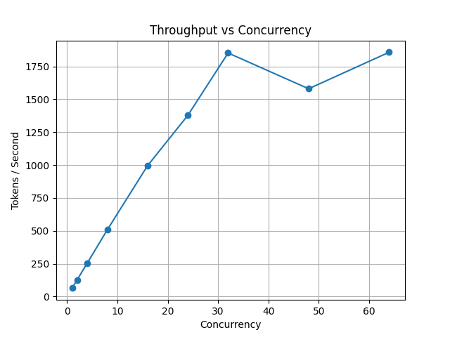
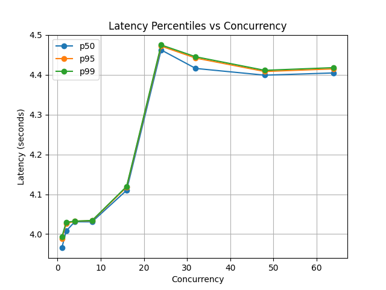
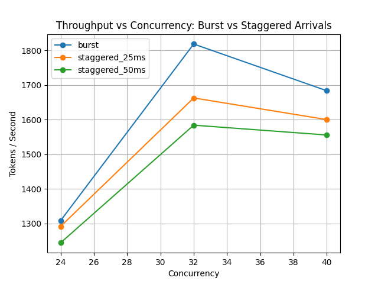
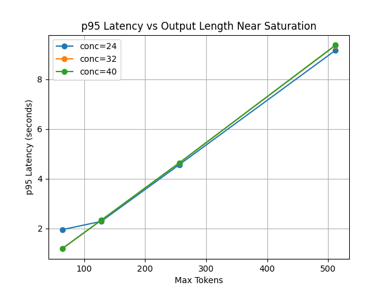
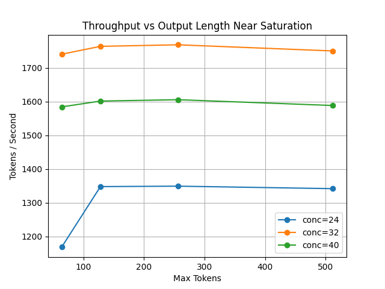
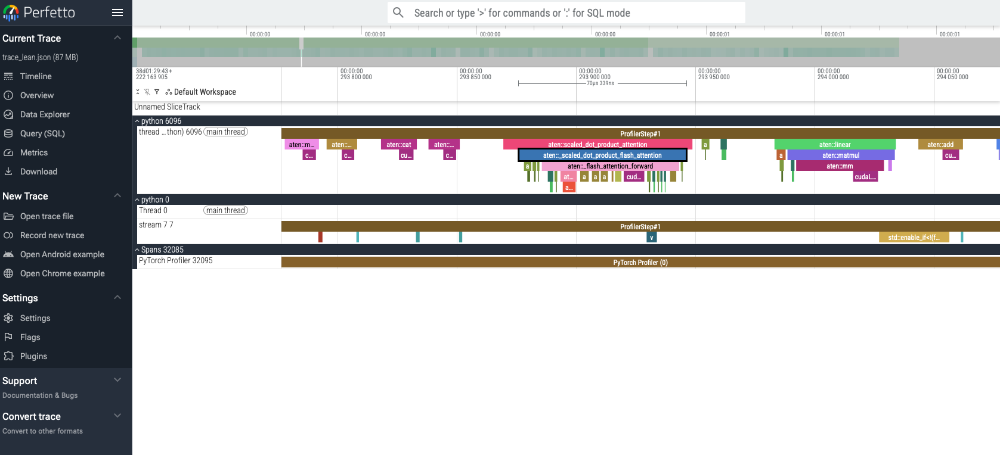

# LLM Inference Benchmark Harness
> Investigating how workload shape, batching behavior, and concurrency impact LLM inference throughput and tail latency under GPU saturation.

A Python benchmarking and profiling harness for evaluating LLM inference systems under concurrency-driven load. The experiments focus on production-relevant inference characteristics including queueing behavior, decode-phase saturation, batching efficiency, and workload-sensitive latency growth.

The goal is to measure **throughput scaling and latency behavior (p50 / p95 / p99)** as load increases and identify the **saturation point of an inference system**.

The harness targets **OpenAI-compatible endpoints**, including:

- vLLM  
- Triton Inference Server  
- TensorRT-LLM  
- OpenAI API-compatible gateways  

This project studies how GPU-accelerated LLM inference systems behave under realistic, concurrency-driven load, with emphasis on:

- batching efficiency  
- scheduler behavior  
- concurrency scaling  
- throughput saturation  
- **workload-dependent latency (output length sensitivity)**  

---

# What This Harness Measures

In particular, this work demonstrates that **throughput alone is an incomplete metric for evaluating LLM inference systems under load**.

For each concurrency level the benchmark records:

- number of requests
- elapsed wall time
- requests/sec
- tokens/sec
- latency p50
- latency p95
- latency p99
- mean latency

The harness sweeps across increasing concurrency levels and produces plots showing:

1. **Throughput scaling**
2. **Tail latency growth**

These curves make it easy to identify when the system transitions from efficient utilization to **queueing and saturation**.

---

# Running the Benchmark

## Running Against OpenAI-Compatible Hosted Endpoints

The harness can target local inference servers or hosted providers that expose
OpenAI-compatible APIs. Use:

- `--api-type completions` for `/v1/completions`
- `--api-type chat` for `/v1/chat/completions`

You can validate the chat request shape without any provider key:

```bash
python tests/test_llm_client.py
```

Before a benchmark run, validate auth, model access, and payload compatibility
with one tiny request. For Together AI:

```bash
export TOGETHER_API_KEY="your_key_here"

python validate_endpoint.py \
  --base-url https://api.together.xyz \
  --api-type chat \
  --api-key-env TOGETHER_API_KEY \
  --model meta-llama/Llama-3.3-70B-Instruct-Turbo
```

Then run a benchmark smoke test against the same endpoint:

```bash
python bench.py \
  --base-url https://api.together.xyz \
  --api-type chat \
  --model meta-llama/Llama-3.3-70B-Instruct-Turbo \
  --concurrency 1,2,4 \
  --max-tokens 128 \
  --requests-per-worker 2 \
  --out results/together_smoke.csv
```

If that succeeds, scale up gradually:

```bash
python bench_experiments.py \
  --base-url https://api.together.xyz \
  --api-type chat \
  --model meta-llama/Llama-3.3-70B-Instruct-Turbo \
  --concurrency 1,2,4,8,16 \
  --max-tokens 256 \
  --requests-per-worker 3 \
  --run-label together_llama_3_3_70b \
  --out results/together_llama_3_3_70b.csv
```

## Together AI Light Sweep

For Together AI specifically, `together_light_sweep.py` runs a conservative
hosted-API sweep with defaults intended for light-to-moderate load:

```bash
python together_light_sweep.py --yes
```

Before sending requests, the script prints the estimated total request count
and maximum generated-token budget. Without `--yes`, it asks for interactive
confirmation.

This measurement is different from the local dedicated-GPU saturation
experiments below. Together's hosted API runs on shared, rate-limited
infrastructure, so slowdowns, tail-latency growth, or HTTP 429 responses cannot
be attributed directly to GPU capacity or scheduler saturation the way they can
when you control the inference server and hardware. Treat this sweep as a
hosted endpoint behavior check under light-to-moderate client load, not as a
claim about Together's hardware saturation point.

## Step 1 — Start an inference server

Example using **vLLM**:

```bash
python -m vllm.entrypoints.openai.api_server \
  --model Qwen/Qwen2.5-7B-Instruct \
  --host 0.0.0.0 \
  --port 8000
```

This exposes an OpenAI-compatible endpoint:

```
http://localhost:8000/v1/completions
```

---

## Step 2 — Run the concurrency sweep

```bash
python bench.py \
  --model Qwen/Qwen2.5-7B-Instruct \
  --concurrency 1,2,4,8,16,24,32,48,64 \
  --max-tokens 256 \
  --requests-per-worker 5 \
  --out results/max_tokens_256.csv
```

This generates:

```
results/max_tokens_256.csv
```

---

## Step 3 — Generate plots

```bash
python plot_results.py
```

This produces:

```
results/throughput_*.png
results/latency_*.png
```

---

# System Configuration

All experiments were run with the following setup:

| Component | Configuration |
|----------|--------------|
| GPU | NVIDIA RTX 4090 (24GB VRAM) |
| Runtime | vLLM |
| Model | Qwen/Qwen2.5-7B-Instruct |
| API | OpenAI-compatible `/v1/completions` |
| Prompt workload | prompts.json (explanatory prompts) |
| Generation lengths tested | 64, 256, 512 tokens |
| Benchmark driver | custom Python asyncio harness |
| Request scheduling | burst + staggered arrival experiments |

The benchmark focuses on **decoder-heavy inference workloads**, which are typically **memory bandwidth bound during autoregressive generation**.

## Experiment 1 - Concurrency Scaling

Experiments were run with three generation workloads:

| max_tokens | Workload Type |
|------------|--------------|
| 64 | short responses |
| 256 | typical assistant responses |
| 512 | long generations |

---

## Throughput (max_tokens = 256)



---

## Latency Percentiles (max_tokens = 256)



---

### Key Observations

Across all workloads the system saturated at approximately:

```
~1800 tokens/sec
```

on an **RTX 4090**.

- aggregate token throughput remained relatively stable
- request throughput decreased as generation length increased
- latency scaled roughly linearly with `max_tokens`
- saturation occurred around **~32 concurrent requests**

This indicates that once the GPU is fully utilized, the system transitions into a **decode-bound regime**, where throughput plateaus and latency becomes increasingly sensitive to request characteristics such as output length.

---

## Experiment 2 — Dynamic Batching Behavior

To better understand how inference schedulers handle request arrival patterns, we evaluated system performance under **burst** and **staggered** request arrivals near the saturation boundary.

Experiments were conducted at:

- concurrency: 24, 32, 40  
- max_tokens: 256  

---

### Arrival Patterns Tested

| Pattern | Description |
|--------|-------------|
| burst | all requests start simultaneously |
| staggered_25ms | each worker delayed by 25ms |
| staggered_50ms | each worker delayed by 50ms |

---

### Throughput vs Arrival Pattern



---

### Results

| Concurrency | Burst | Staggered 25ms | Staggered 50ms |
|-------------|------|---------------|---------------|
| 24 | ~1308 tokens/s | ~1291 tokens/s | ~1244 tokens/s |
| 32 | **~1819 tokens/s** | ~1663 tokens/s | ~1584 tokens/s |
| 40 | ~1684 tokens/s | ~1600 tokens/s | ~1556 tokens/s |

---

### Key Observations

- Peak throughput is achieved under **burst arrivals**
- Staggering requests results in a **small but consistent reduction in throughput**
- The effect is most pronounced near the **saturation point (32 concurrency)**

---

### Interpretation

These results indicate that **vLLM’s continuous batching scheduler is already optimized for bursty traffic**.

Even when requests arrive simultaneously, the scheduler efficiently:

- queues incoming requests  
- dynamically forms large batches  
- maximizes GPU utilization during decoding  

Artificially smoothing request arrivals does not improve performance and can slightly reduce batching efficiency.

This reflects how modern inference engines operate:

> They rely on internal request queues and token-level schedulers to construct optimal batches during autoregressive decoding, rather than depending on externally controlled traffic shaping.

---

## Experiment 3 — Output Length Sensitivity Near Saturation

To understand how workload shape impacts system performance, we evaluated latency and throughput near the saturation boundary while varying generation length.

Experiments were conducted at:

- concurrency: 24, 32, 40  
- max_tokens: 64, 128, 256, 512  

---

### Results (32 Concurrency)

| max_tokens | tokens/sec | p95 latency |
|------------|-----------|------------|
| 64 | ~1740 | ~1.17s |
| 128 | ~1763 | ~2.32s |
| 256 | ~1768 | ~4.63s |
| 512 | ~similar throughput | ~higher latency |

---

### Latency vs Output Length



### Throughput vs Output Length




### Key Observations

- Throughput remains **relatively stable near saturation** across different output lengths  
- Latency increases **approximately linearly with max_tokens**  
- Increasing concurrency beyond saturation does not improve throughput  

---

### Interpretation

At the saturation boundary, the system maintains high throughput due to efficient batching and GPU utilization.

However, **tail latency increases significantly for longer generations**, indicating that response time is dominated by decode duration rather than scheduling inefficiencies.

This reveals a key production insight:

> Throughput alone is not sufficient to evaluate inference performance. Workload characteristics, especially output length, directly impact latency and user experience.

---

### GPU Profiling (Nsight Systems)

To validate system behavior at saturation, a lightweight Nsight Systems profile was performed for a representative workload:

- concurrency: 32  
- max_tokens: 512  

The profiling timeline showed:

- sustained GPU activity throughout request processing  
- minimal idle gaps between kernel executions  
- consistent kernel execution patterns during decoding  

This supports the earlier observation that:

> Latency increases near saturation are driven by decode duration and queueing effects, rather than GPU underutilization.

Raw profiling artifacts are not included in the repository.

---

### Practical Implication

Inference systems should be sized based on:

- expected output length distributions  
- latency SLOs (p95 / p99)  
- not just peak tokens/sec capacity  

This is particularly important for applications such as:

- chat assistants (short responses)  
- agent workflows (medium responses)  
- code generation or summarization (long responses)

---

### Motivation

LLM inference performance is often evaluated using **single-request latency**, which does not reflect real production conditions.

This experiment focuses on **concurrency-driven load behavior**, providing a more realistic view of:

- GPU utilization under load  
- batching efficiency  
- scheduler effectiveness  
- system behavior near saturation  

By simulating bursty and staggered traffic patterns, we better approximate real-world request distributions and uncover how inference systems behave under sustained load.

---

# System Insights

This benchmark highlights several key properties of modern LLM inference systems:

- **Saturation occurs at a concurrency threshold**, beyond which additional load increases latency without improving throughput  
- **Throughput alone is not a sufficient performance metric** — tail latency reveals system stress earlier  
- **Modern schedulers (e.g., vLLM) effectively handle bursty traffic**, reducing the need for external request smoothing  
- **Decode-heavy workloads are memory-bandwidth bound**, leading to near-linear latency scaling with output length  
- **Workload shape (output length, concurrency)** directly impacts system behavior and must be considered in capacity planning  

These findings emphasize the importance of evaluating inference systems under realistic load conditions rather than relying solely on single-request benchmarks.

---

# PyTorch Profiler Analysis

To better understand operator-level execution behavior during inference, a lightweight PyTorch Profiler workflow was added using:

- PyTorch Profiler
- Perfetto trace visualization
- CUDA activity tracing

The profiling workflow captured:

- `aten::scaled_dot_product_attention`
- Flash Attention execution paths
- CUDA kernel dispatch activity
- matrix multiplication operators (`aten::matmul`)
- linear projection layers (`aten::linear`)

This establishes a baseline workflow for analyzing:
- operator-level bottlenecks
- attention-heavy execution regions
- CPU-to-GPU dispatch behavior
- decode-phase execution characteristics

Example Perfetto trace:



# Future Work

- compare vLLM vs TensorRT-LLM scheduling behavior
- analyze GPU kernel timelines with Nsight Systems
- correlate throughput saturation with GPU utilization metrics
- evaluate KV-cache pressure under long-context workloads
- benchmark multi-GPU inference scaling and NCCL communication overhead
- analyze batching efficiency under heterogeneous request mixes

---

# License

MIT License  
Marco Punio — 2026
