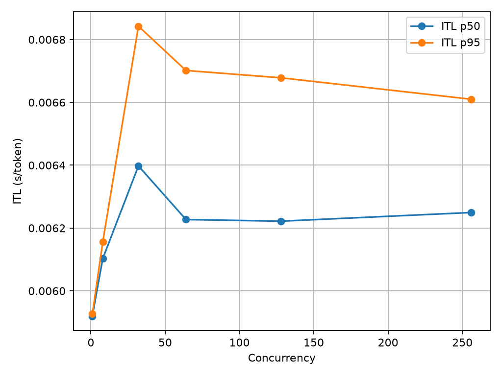
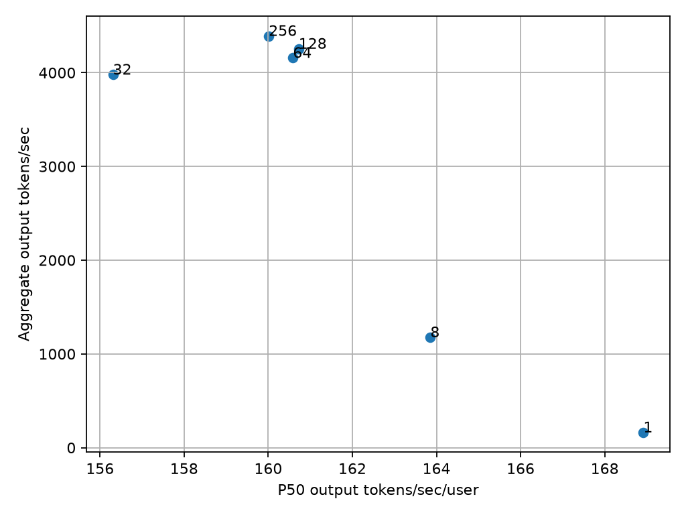
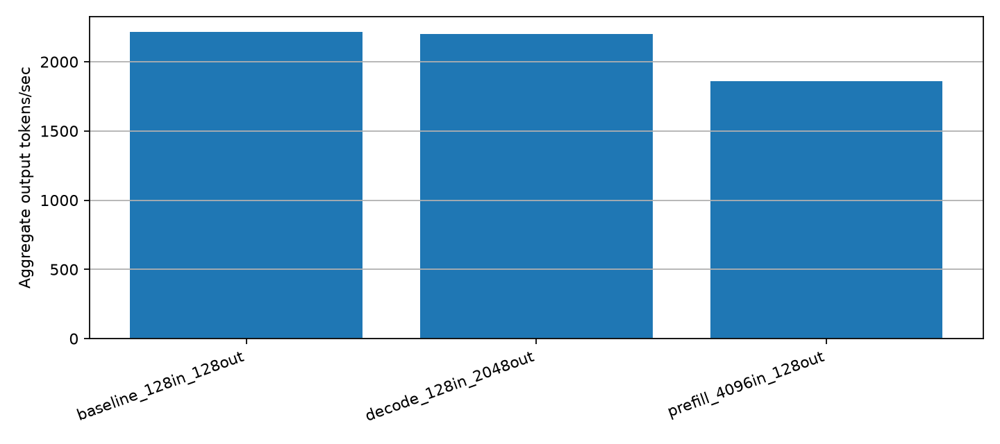

# Streaming Inference Performance Report

## Key Takeaways

- Aggregate throughput is not the same as user interactivity. Aggregate output tokens/sec describes total system work completed per second; per-user output tokens/sec describes the generation rate a single active request experiences after the first token.
- TTFT primarily exposes behavior before the first generated token, including request admission, scheduling, tokenization overhead, and prefill work.
- ITL and output tokens/sec/user characterize generation after the first token, where decode cadence dominates the perceived streaming experience.
- Workload shape materially affects which latency component dominates: long inputs primarily move TTFT in this run, while long outputs primarily move end-to-end request latency.

## Experimental Setup

| Field | Value |
|-------|-------|
| Hardware | RunPod dedicated GPU pod |
| GPU model | NVIDIA H100 80GB HBM3 |
| GPU count | 1 |
| Model | `Qwen/Qwen2.5-7B-Instruct` |
| Serving runtime | vLLM `0.30.0` |
| PyTorch | `2.13.0+cu130` |
| CUDA | CUDA `13.0` visible to PyTorch and NVIDIA-SMI |
| Precision | `bfloat16` |
| Tensor parallel size | 1 |
| Max model length | 32768 |
| API | OpenAI-compatible `/v1/completions` |
| Important launch args | `vllm serve Qwen/Qwen2.5-7B-Instruct --host 0.0.0.0 --port 8000 --dtype bfloat16` |
| Relevant vLLM behavior from startup logs | chunked prefill enabled, prefix caching enabled, FlashAttention 3 selected, CUDA graphs captured |

Warmup requests were run before measurement and were not included in the result files.

## Metric Formulas

- Request latency: request completion timestamp - request submission timestamp.
- TTFT: first non-empty streamed token timestamp - request submission timestamp.
- Decode duration: last streamed token timestamp - first streamed token timestamp.
- ITL: request-level decode duration / (`output_tokens - 1`).
- TPOT: (`request latency - TTFT`) / `output_tokens`.
- Output tokens/sec/user: (`output_tokens - 1`) / decode duration.
- Aggregate output tokens/sec: total generated output tokens / benchmark wall-clock duration.
- Requests/sec: completed requests / benchmark wall-clock duration.

Input/output token counts were obtained through vLLM tokenization during the run.
Because streaming APIs may emit multi-token text chunks, ITL here is a
request-level average decode cadence computed from first-token and last-token
timestamps plus tokenizer-derived output token counts. The reported P50/P95 ITL
values are percentiles across those per-request averages, not percentiles over
every individual token gap.

## Measured Results

### Concurrency Sweep

Workload: ~128 input tokens, 128 requested output tokens.

| Concurrency | Requests | Aggregate output tok/s | Output tok/s/user P50 | TTFT P50 | TTFT P95 | ITL P50 | ITL P95 | Request latency P50 | GPU util mean |
|-------------|----------|------------------------|-----------------------|----------|----------|---------|---------|---------------------|---------------|
| 1 | 2 | 163 | 169 | 24.7 ms | 28.8 ms | 5.92 ms | 5.93 ms | 0.777 s | 72.3% |
| 8 | 16 | 1,178 | 164 | 64.4 ms | 71.5 ms | 6.10 ms | 6.16 ms | 0.839 s | 99.3% |
| 32 | 64 | 3,979 | 156 | 85.3 ms | 125.2 ms | 6.40 ms | 6.84 ms | 0.901 s | 100.0% |
| 64 | 128 | 4,158 | 161 | 95.0 ms | 157.4 ms | 6.23 ms | 6.70 ms | 0.886 s | 88.4% |
| 128 | 256 | 4,255 | 161 | 72.9 ms | 141.9 ms | 6.22 ms | 6.68 ms | 0.868 s | 94.8% |
| 256 | 512 | 4,392 | 160 | 65.0 ms | 122.7 ms | 6.25 ms | 6.61 ms | 0.859 s | 97.4% |

### Workload Shape

Concurrency: 16. Requests per worker: 2.

| Profile | Input tokens | Requested output tokens | Aggregate output tok/s | Output tok/s/user P50 | TTFT P50 | ITL P50 | Request latency P50 |
|---------|--------------|-------------------------|------------------------|-----------------------|----------|---------|---------------------|
| Baseline | 136 | 128 | 2,215 | 162 | 81.5 ms | 6.17 ms | 0.865 s |
| Prefill-heavy | 4,105 | 128 | 1,858 | 152 | 190.3 ms | 6.56 ms | 1.031 s |
| Decode-heavy | 136 | 2,048 | 2,201 | 157 | 72.8 ms | 6.39 ms | 13.150 s |

## Measured Observations

Aggregate throughput increased from about 163 output tok/s at concurrency 1 to about 3,979 output tok/s at concurrency 32. Throughput then began flattening, reaching about 4,392 output tok/s at concurrency 256.

Per-user generation speed did not collapse as concurrency increased. At higher concurrency levels it remained approximately 156-161 output tok/s/user.

P50 ITL stayed in a narrow band across most of the concurrency sweep, approximately 6.2-6.4 ms/token from concurrency 32 through 256.

Increasing input length from about 128 tokens to about 4096 tokens increased P50 TTFT from about 81 ms to about 190 ms. ITL changed much less, moving from about 6.17 ms/token to about 6.56 ms/token.

Increasing requested output length to 2048 tokens produced about 13.15 seconds P50 end-to-end latency, while TTFT remained about 73 ms and ITL remained about 6.39 ms/token.

## Interpretations

The concurrency sweep shows the difference between aggregate throughput and per-user interactivity. Aggregate throughput rose sharply through concurrency 32, then flattened. At the same time, per-user generation speed and ITL stayed relatively stable at higher concurrency. In this run, batching improved total system throughput without materially degrading per-user decode cadence over the tested range.

The workload-shape experiment shows that long inputs and long outputs affect different latency components. The prefill-heavy profile increased TTFT much more than ITL, which is consistent with additional work before the first token. The decode-heavy profile increased total request latency because many more output tokens were generated, while TTFT and ITL remained close to the baseline.

The interactivity-throughput frontier should be read as a shape, not a single scalar optimum. The useful operating point depends on whether the service values maximum aggregate tokens/sec, low TTFT, or stable per-user streaming rate.

## Hypotheses Requiring Additional Profiling

The observed prefill-heavy behavior is consistent with transformer inference expectations: long prompts increase prefill work before the first token can be emitted. However, this experiment alone does not prove that prefill was compute-bound.

The observed decode-heavy behavior is consistent with decode-phase token generation dominating long-output latency, and with common expectations that autoregressive decode can become memory-bandwidth-sensitive. However, this experiment alone does not prove that decode was memory-bandwidth-bound.

Validating those hypotheses would require hardware-level and runtime-level evidence, such as SM occupancy, memory bandwidth counters, kernel timelines, vLLM scheduler queue depth, KV-cache behavior, and per-phase prefill/decode timing from the serving runtime.

The GPU telemetry collected here is intentionally coarse. NVIDIA-SMI polling is
useful context for utilization, but memory-used values can reflect allocated or
reserved memory, including model weights and KV-cache reservation, rather than
the dynamic working set of an individual request.

## Plots

## Additional Profiling Needed

To turn the bottleneck hypotheses into stronger claims, collect:

- GPU SM utilization and memory bandwidth counters with Nsight Systems / Nsight Compute.
- vLLM scheduler queue depth, waiting time, prefill time, and decode time if exposed by metrics or tracing.
- KV-cache utilization and block allocation behavior.
- Per-kernel timelines for prefill-heavy and decode-heavy profiles.
- Repeated runs to quantify variance and confidence intervals.
